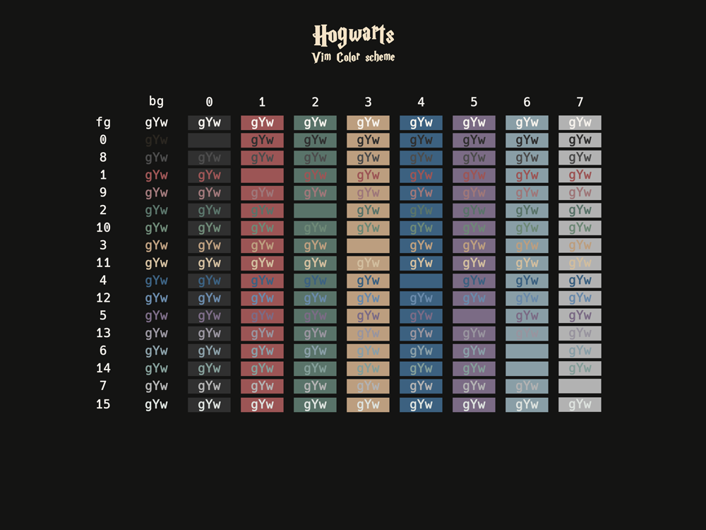
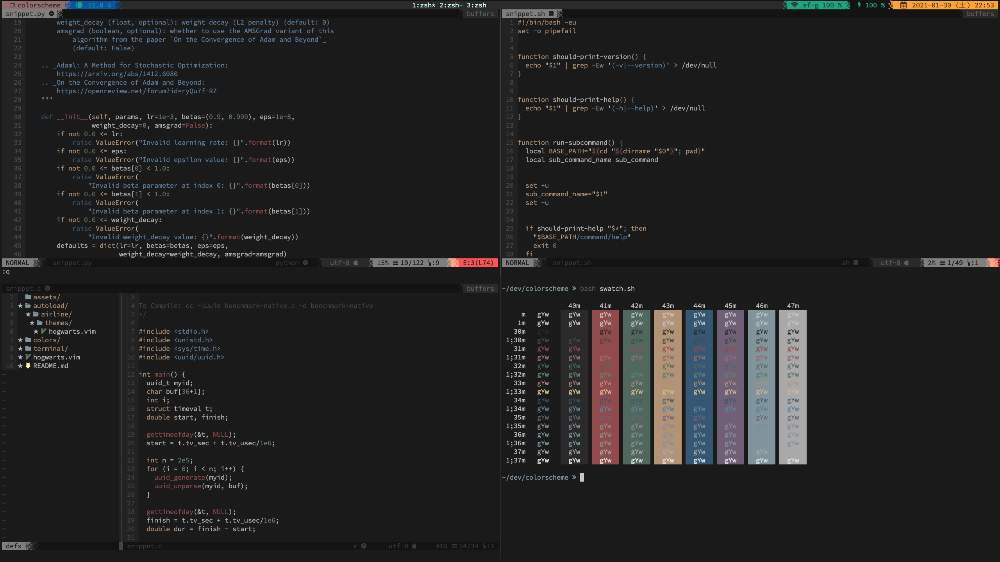
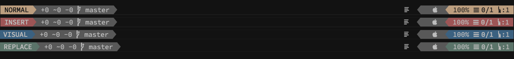

# Hogwarts

Hogwarts is a colorscheme based on the infamous series of Harry Potter.

## Features
- 256-colors termial support
- Terminal color support (iTerm2 only)
- airline theme

## License
MIT License.
